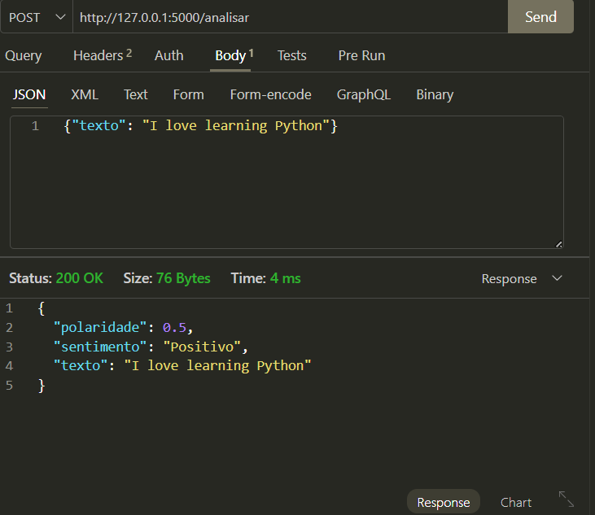

# API de Análise de Sentimento - Python Pro 🚀

Este projeto consiste numa API REST desenvolvida em Python utilizando as bibliotecas **Flask** e **TextBlob** para Processamento de Linguagem Natural (NLP). O objetivo é receber um texto e classificar a sua polaridade entre Positivo, Negativo ou Neutro.

## 🛠️ Tecnologias Utilizadas

- **Python 3.12+**
- **Flask**: Framework web para criação da API.
- **TextBlob**: Biblioteca de NLP para processamento de dados textuais.
- **Virtualenv**: Isolamento de ambiente de desenvolvimento.

## 📋 Funcionalidades

- `GET /`: Rota de verificação de status da API.
- `POST /analisar`: Recebe um JSON contendo um texto e retorna a análise de sentimento.

## 🚀 Como Executar o Projeto

### 1. Clonar o Repositório
```bash
git clone https://github.com/Lucasnb2001/projeto-python-pro-dev.git

cd projeto-python-pro
```

### 2. Configurar Ambiente Virtual (Windows)
```bash
# Criar o ambiente
python -m venv .venv

# Ativar o ambiente
.venv\Scripts\activate
```
### 3. Instalar Dependências
```bash
pip install -r requirements.txt
```
### 4. Iniciar a API
```bash
flask run
```
Para testar outras APIs do repositório basta adicionar o parâmetro --app [nome_do_arquivo] como no exemplo abaixo   
```bash
flask --app hello run
```
A API estará disponível em http://127.0.0.1:5000.   

## 🧪 Como Testar
Podemos testar a rota de análise enviando um POST via PowerShell ou ferramentas como Postman/Insomnia/Thunder Client
### Exemplo de resposta
